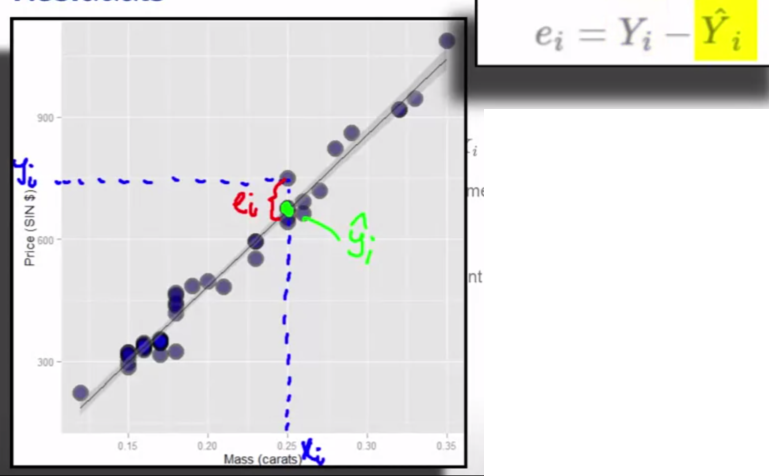

```{r setup, cache = F, echo = F, message = F, warning = F, tidy = F, results='hide'}
# make this an external chunk that can be included in any file
library(knitr)
options(width = 100)
opts_chunk$set(message = F, error = F, warning = F, comment = NA, fig.align = 'center', dpi = 100, tidy = F, cache.path = '.cache/', fig.path = 'fig/')

options(xtable.type = 'html')
knit_hooks$set(inline = function(x) {
  if(is.numeric(x)) {
    round(x, getOption('digits'))
  } else {
    paste(as.character(x), collapse = ', ')
  }
})
knit_hooks$set(plot = knitr:::hook_plot_html)
runif(1)
```

# Formulas

Model: $\hat y = \beta_0 + \beta_1 x$

- y-intercept + slope * x
- `^` for predicted

Slope:$\beta_1 = \frac{r S_y}{S_x}$

- $S_y$ Standard deviation for $y$
- $S_x$ Standard deviation for $x$
- $\frac{rise}{run}$ How much does $y$ rise when $x$ increases by one unit
    - here, unit is in standard deviation
    - therefore $S_y$ and $S_x$
    - $r$ is the factor for $rise$. How much standard deviation does $y$ rise when $sd(x)$ increases by one standard deviation

y-Intercept: $\beta_0 = \bar y-\beta_1 \hat x$

- `-` for average (mean)
- $\hat x$ average of all $x$
- $\hat y$ average of all $y$

# Data Example

```{r, message=FALSE}
library("UsingR")
library("reshape")
library("ggplot2")
library("dplyr")
```

## Childred heights

```{r}
data(galton)
long <- melt(galton)
g <- ggplot(long, aes(x=value, fill=variable))
g <- g + geom_histogram(colour="black", binwidth=1)
g <- g + facet_grid(. ~ variable)
g
```

### Basic Least Square

```{r, echo = TRUE, eval = FALSE}
library(manipulate)
data(galton)
myHist <- function(mu) {
  mse <- mean((galton$child - mu)^2)
  g <- ggplot(galton, aes(x=child))
  g <- g + geom_histogram(colour="black", fill="salmon", binwidth=1)
  g <- g + geom_vline(xintercept=mu, size=3)
  g <- g + ggtitle(paste("mu = ", mu, " MSE (Mean Square Error)= ", round(mse, 2), sep=""))
  g
}
manipulate(myHist(mu), mu = slider(62, 74, step=0.5))
```

```{r}
g <- ggplot(galton, aes(x=child))
g <- g + geom_histogram(colour="black", fill="salmon", binwidth=1)
g <- g + geom_vline(xintercept=mean(galton$child), size=3)
g
mean(galton$child)
```

## Comparing childrens' height and their parent heights

A very bad plot
```{r}
ggplot(galton, aes(x = parent, y = child)) + geom_point()
```
There's overplotting, multiple points at the same location.

A better plot
```{r}
freqData <- as.data.frame(table(galton$child, galton$parent))
names(freqData) <- c("child", "parent", "freq")
freqData$child <- as.numeric(as.character(freqData$child))
freqData$parent <- as.numeric(as.character(freqData$parent))
g <- ggplot(filter(freqData, freq > 0), aes(x = parent, y = child))
g <- g  + scale_size(range = c(2, 20), guide = "none" )
g <- g + geom_point(colour="grey50", aes(size = freq+20, show_guide = FALSE))
g <- g + geom_point(aes(colour=freq, size = freq))
g <- g + scale_colour_gradient(low = "lightblue", high="white")                    
g
```

Regression to the origin

The regression line goes through $0,0$. But often $0,0$ is outside the data, so we center the data at $0,0$ the mean of $x$ and $y$.


```{r, echo = TRUE, eval = FALSE}
y <- galton$child - mean(galton$child)
x <- galton$parent - mean(galton$parent)
freqData <- as.data.frame(table(x, y))
names(freqData) <- c("child", "parent", "freq")
freqData$child <- as.numeric(as.character(freqData$child))
freqData$parent <- as.numeric(as.character(freqData$parent))
myPlot <- function(beta){
    g <- ggplot(filter(freqData, freq > 0), aes(x = parent, y = child))
    g <- g  + scale_size(range = c(2, 20), guide = "none" )
    g <- g + geom_point(colour="grey50", aes(size = freq+20, show_guide = FALSE))
    g <- g + geom_point(aes(colour=freq, size = freq))
    g <- g + scale_colour_gradient(low = "lightblue", high="white")                     
    g <- g + geom_abline(intercept = 0, slope = beta, size = 3)
    mse <- mean( (y - beta * x) ^2 )
    g <- g + ggtitle(paste("beta = ", beta, "mse = ", round(mse, 3)))
    g
}
manipulate(myPlot(beta), beta = slider(0.6, 1.2, step = 0.02))
```
A $\beta$ around $0.64$ seems to have the lowest mean square error.

### R Solution
```{r}
lm(I(child - mean(child))~ I(parent - mean(parent)) - 1, data = galton)
```

```{r, fig.height=6,fig.width=7,echo=FALSE}
freqData <- as.data.frame(table(galton$child, galton$parent))
names(freqData) <- c("child", "parent", "freq")
freqData$child <- as.numeric(as.character(freqData$child))
freqData$parent <- as.numeric(as.character(freqData$parent))
g <- ggplot(filter(freqData, freq > 0), aes(x = parent, y = child))
g <- g  + scale_size(range = c(2, 20), guide = "none" )
g <- g + geom_point(colour="grey50", aes(size = freq+20, show_guide = FALSE))
g <- g + geom_point(aes(colour=freq, size = freq))
g <- g + scale_colour_gradient(low = "lightblue", high="white")                    
lm1 <- lm(galton$child ~ galton$parent)
g <- g + geom_abline(intercept = coef(lm1)[1], slope = coef(lm1)[2], size = 3, colour = grey(.5))
g
```

With lm
```{r, fig.height=6,fig.width=7,echo=FALSE}
freqData <- as.data.frame(table(galton$child, galton$parent))
names(freqData) <- c("child", "parent", "freq")
freqData$child <- as.numeric(as.character(freqData$child))
freqData$parent <- as.numeric(as.character(freqData$parent))
g <- ggplot(filter(freqData, freq > 0), aes(x = parent, y = child))
g <- g  + scale_size(range = c(2, 20), guide = "none" )
g <- g + geom_point(colour="grey50", aes(size = freq+20, show_guide = FALSE))
g <- g + geom_point(aes(colour=freq, size = freq))
g <- g + scale_colour_gradient(low = "lightblue", high="white")                    
g <- g + geom_smooth(method="lm", formula=y~x)
g
```

# Notation

## Notation for data

* We write $X_1, X_2, \ldots, X_n$ to describe $n$ data points.
* As an example, consider the data set $\{1, 2, 5\}$ then 
  * $X_1 = 1$, $X_2 = 2$, $X_3 = 5$ and $n = 3$.
* We often use a different letter than $X$, such as $Y_1, \ldots , Y_n$.
* We will typically use Greek letters for things we don't know. 
  Such as, $\mu$ is a mean that we'd like to estimate.


## The empirical mean 

* Define the empirical mean as
$$
\bar X = \frac{1}{n}\sum_{i=1}^n X_i. 
$$
* Notice if we subtract the mean from data points, we get data that has mean 0. That is, if we define
$$
\tilde X_i = X_i - \bar X.
$$
The mean of the $\tilde X_i$ is 0.
* This process is called "centering" the random variables.
* Recall from the previous lecture that the mean is 
  the least squares solution for minimizing
  $$
  \sum_{i=1}^n (X_i - \mu)^2
  $$


## The emprical standard deviation and variance

* Define the empirical variance as 
$$
S^2 = \frac{1}{n-1} \sum_{i=1}^n (X_i - \bar X)^2 
= \frac{1}{n-1} \left( \sum_{i=1}^n X_i^2 - n \bar X ^ 2 \right)
$$
* The empirical standard deviation is defined as
$S = \sqrt{S^2}$. Notice that the standard deviation has the same units as the data.
* The data defined by $X_i / s$ have empirical standard deviation 1. This is called "scaling" the data.

## Normalization

* The data defined by
$$
Z_i = \frac{X_i - \bar X}{s}
$$
have empirical mean zero and empirical standard deviation 1. 
* The process of centering then scaling the data is called "normalizing" the data. 
* Normalized data are centered at 0 and have units equal to standard deviations of the original data. 
* Example, a value of 2 from normalized data means that data point
was two standard deviations larger than the mean.

## The empirical covariance
* Consider now when we have pairs of data, $(X_i, Y_i)$.
* Their empirical covariance is 
$$
Cov(X, Y) = 
\frac{1}{n-1}\sum_{i=1}^n (X_i - \bar X) (Y_i - \bar Y)
= \frac{1}{n-1}\left( \sum_{i=1}^n X_i Y_i - n \bar X \bar Y\right)
$$
* The correlation is defined is
$$
Cor(X, Y) = \frac{Cov(X, Y)}{S_x S_y}
$$
where $S_x$ and $S_y$ are the estimates of standard deviations 
for the $X$ observations and $Y$ observations, respectively.

## Some facts about correlation
* $Cor(X, Y) = Cor(Y, X)$
* $-1 \leq Cor(X, Y) \leq 1$
* $Cor(X,Y) = 1$ and $Cor(X, Y) = -1$ only when the $X$ or $Y$ observations fall perfectly on a positive or negative sloped line, respectively.
* $Cor(X, Y)$ measures the strength of the linear relationship between the $X$ and $Y$ data, with stronger relationships as $Cor(X,Y)$ heads towards -1 or 1.
* $Cor(X, Y) = 0$ implies no linear relationship. 


# Linear Regression for Prediction Example

```{r, message=FALSE}
library(UsingR)
library(ggplot2)
data(diamond)
```
```{r}
g <- ggplot(diamond, aes(x=carat, y=price))
g <- g + xlab("Mass (carate)")
g <- g + ylab("Price (SIN $)")
g <- g + geom_point(size=6, color="black", alpha=0.2)
g <- g + geom_point(size=5, color="blue", alpha=0.2)
g <- g + geom_smooth(method="lm", color="black")
g
```
```{r}
fit <- lm(price ~ carat, data=diamond)
coef(fit) # intercept (beta_0) and slope (beta_1)
```

Interpretation of coef:

We estimate an expected `r round(coef(fit)[2],2)` (SIN) dollar increase in price for every carat increase in mass of diamont.

The intercept `r round(coef(fit)[1],2)` is the expected price of an 0 carat diamond. **We aren't interested in 0 carat diamonds in this example**

## Getting a more interpretable intercept

Center around the mean

```{r}
fit2 <- lm(price ~ I(carat - mean(carat)), data=diamond)
coef(fit2)
```

Thus $`r round(coef(fit2)[1], 2)` is the expected price for the average sized diamond of the data (`r round(mean(diamond$carat),4)` carats).

Carat is quite a big unit. Let's use 1/10th of a carat

```{r}
fit3 <- lm(price ~ I(carat * 10), data=diamond)
coef(fit3)
```

## Predicting the price of a diamond

New diamonds with following carats
```{r}
newx <- c(0.16, 0.27, 0.34)
```

```{r}
# manually
# beta_0 + beta_1 * X
coef(fit)[1] + coef(fit)[2] * newx
# using the predict function
result <- predict(fit, newdata=data.frame(carat = newx))
result
```

```{r}
plot(diamond$carat, diamond$price,  
     xlab = "Mass (carats)", 
     ylab = "Price (SIN $)", 
     bg = "lightblue", 
     col = "black", cex = 1.1, pch = 21,frame = FALSE)
abline(fit, lwd = 2)
points(diamond$carat, predict(fit), pch = 19, col = "red")
lines(c(0.16, 0.16, 0.12), 
      c(200, coef(fit)[1] + coef(fit)[2] * 0.16,
      coef(fit)[1] + coef(fit)[2] * 0.16))
lines(c(0.27, 0.27, 0.12), 
      c(200, coef(fit)[1] + coef(fit)[2] * 0.27,
        coef(fit)[1] + coef(fit)[2] * 0.27))
lines(c(0.34, 0.34, 0.12), 
      c(200, coef(fit)[1] + coef(fit)[2] * 0.34,
        coef(fit)[1] + coef(fit)[2] * 0.34))
text(newx, rep(250, 3), labels = newx, pos = 2)
```

# Residuals and residual variation

## Motivating example
### `diamond` data set from `UsingR` 
Data is diamond prices (Singapore dollars) and diamond weight
in carats (standard measure of diamond mass, 0.2 $g$). To get the data use `library(UsingR); data(diamond)`

```{r, echo = FALSE}
library(UsingR)
data(diamond)
library(ggplot2)
g = ggplot(diamond, aes(x = carat, y = price))
g = g + xlab("Mass (carats)")
g = g + ylab("Price (SIN $)")
g = g + geom_smooth(method = "lm", colour = "black")
g = g + geom_point(size = 7, colour = "black", alpha=0.5)
g = g + geom_point(size = 5, colour = "blue", alpha=0.2)
g
```

We want to explain price (y-axis) by mass (x-axis).

## Residuals
* Model $Y_i = \beta_0 + \beta_1 X_i + \epsilon_i$ where $\epsilon_i \sim N(0, \sigma^2)$.
* Observed outcome $i$ is $Y_i$ at predictor value $X_i$
* Predicted outcome $i$ is $\hat Y_i$ at predictor valuve $X_i$ is
  $$
  \hat Y_i = \hat \beta_0 + \hat \beta_1 X_i
  $$
* Residual, the between the observed and predicted outcome
  $$
  e_i = Y_i - \hat Y_i
  $$
  * The vertical distance between the observed data point and the regression line
* Least squares minimizes $\sum_{i=1}^n e_i^2$
* The $e_i$ can be thought of as estimates of the $



## Properties of the residuals
* $E[e_i] = 0$.
* If an intercept is included, $\sum_{i=1}^n e_i = 0$
* If a regressor variable, $X_i$, is included in the model $\sum_{i=1}^n e_i X_i = 0$. 
* Residuals are useful for investigating poor model fit.
* Positive residuals are above the line, negative residuals are below.
* Residuals can be thought of as the outcome ($Y$) with the
  linear association of the predictor ($X$) removed.
* One differentiates residual variation (variation after removing
the predictor) from systematic variation (variation explained by the regression model).
* Residual plots highlight poor model fit.

## Coding example

```{r}
data(diamond)
y <- diamond$price; 
x <- diamond$carat; 
n <- length(y)
fit <- lm(y ~ x)
e <- resid(fit)
yhat <- predict(fit)
# show that resid() produces the same result as manually with y - yhat.
max(abs(e -(y - yhat)))
# show that resid() produces the same value as manually calculating yhat.
max(abs(e - (y - coef(fit)[1] - coef(fit)[2] * x)))
# residuals must be 0
sum(e)
# residuals * price must be 0, too
sum(e * x)
```

## Residuals are the signed length of the red lines
```{r, fig.height=5, fig.width=5}
plot(diamond$carat, diamond$price,  
     xlab = "Mass (carats)", 
     ylab = "Price (SIN $)", 
     bg = "lightblue", 
     col = "black", cex = 2, pch = 21,frame = FALSE)
abline(fit, lwd = 2)
for (i in 1 : n) 
  lines(c(x[i], x[i]), c(y[i], yhat[i]), col = "red" , lwd = 2)
```

## Residuals versus X

Looking closely at the variation of the residuals. It should be random and no pattern should be visible.
```{r, fig.height=5, fig.width=5}
plot(x, e,  
     xlab = "Mass (carats)", 
     ylab = "Residuals (SIN $)", 
     bg = "lightblue", 
     col = "black", cex = 2, pch = 21,frame = FALSE)
abline(h = 0, lwd = 2)
for (i in 1 : n) 
  lines(c(x[i], x[i]), c(e[i], 0), col = "red" , lwd = 2)
```

## Non-linear data

(unrelated to the diamond example)

```{r, fig.height=5, fig.width=5}
x = runif(100, -3, 3); y = x + sin(x) + rnorm(100, sd = .2); 
library(ggplot2)
g = ggplot(data.frame(x = x, y = y), aes(x = x, y = y))
g = g + geom_smooth(method = "lm", colour = "black")
g = g + geom_point(size = 7, colour = "black", alpha = 0.4)
g = g + geom_point(size = 5, colour = "red", alpha = 0.4)
g
```

With the sin(x) we have a non linear model. Even though the lm is not the right model we still ge a good result. The sin(x) is visible in the residuals but that's not always that clear. So, it's good to see the residual plot as well.


## Residual plot
```{r, fig.height=5, fig.width=5}
g = ggplot(data.frame(x = x, y = resid(lm(y ~ x))), 
           aes(x = x, y = y))
g = g + geom_hline(yintercept = 0, size = 2); 
g = g + geom_point(size = 7, colour = "black", alpha = 0.4)
g = g + geom_point(size = 5, colour = "red", alpha = 0.4)
g = g + xlab("X") + ylab("Residual")
g
```

The residual plot not highlights the sin(x) part of our data.

## Heteroskedasticity

(new example!)
```{r, fig.height=4.5, fig.width=4.5}
x <- runif(100, 0, 6); y <- x + rnorm(100,  mean = 0, sd = .001 * x); 
g = ggplot(data.frame(x = x, y = y), aes(x = x, y = y))
g = g + geom_smooth(method = "lm", colour = "black")
g = g + geom_point(size = 7, colour = "black", alpha = 0.4)
g = g + geom_point(size = 5, colour = "red", alpha = 0.4)
g
```
Looks like the points match the identiy line, but...

### Getting rid of the blank space can be helpful
```{r, fig.height=4.5, fig.width=4.5}
g = ggplot(data.frame(x = x, y = resid(lm(y ~ x))), 
           aes(x = x, y = y))
g = g + geom_hline(yintercept = 0, size = 2); 
g = g + geom_point(size = 7, colour = "black", alpha = 0.4)
g = g + geom_point(size = 5, colour = "red", alpha = 0.4)
g = g + xlab("X") + ylab("Residual")
g
```
The increase of variability when x is increasing is called Heteroskedasticity.

## Diamond data residual plot
(Back to the diamond data!)
```{r, fig.height=4.5, fig.width=4.5}
diamond$e <- resid(lm(price ~ carat, data = diamond))
g = ggplot(diamond, aes(x = carat, y = e))
g = g + xlab("Mass (carats)")
g = g + ylab("Residual price (SIN $)")
g = g + geom_hline(yintercept = 0, size = 2)
g = g + geom_point(size = 7, colour = "black", alpha=0.5)
g = g + geom_point(size = 5, colour = "blue", alpha=0.2)
g
```
No pattern in the plot. Seems to be a good fit.

## Diamond data residual plot

```{r, fig.height=4.5, fig.width=4.5}
e = c(resid(lm(price ~ 1, data = diamond)), # variation around the average price
      resid(lm(price ~ carat, data = diamond))) # variation around the regression line
fit = factor(c(rep("Itc", nrow(diamond)),
               rep("Itc, slope", nrow(diamond))))
g = ggplot(data.frame(e = e, fit = fit), aes(y = e, x = fit, fill = fit))
g = g + geom_dotplot(binaxis = "y", size = 2, stackdir = "center", binwidth = 20)
g = g + xlab("Fitting approach")
g = g + ylab("Residual price")
g
```

Left: variation in diamon prices around the average diamond price
Right: varia around the regression line

We've explained a lot of the variation of the sample data with the relationship with mass.

## Estimating residual variation
* Model $Y_i = \beta_0 + \beta_1 X_i + \epsilon_i$ where $\epsilon_i \sim N(0, \sigma^2)$.
* The ML estimate of $\sigma^2$ is $\frac{1}{n}\sum_{i=1}^n e_i^2$,
the average squared residual. 
* Most people use
  $$
  \hat \sigma^2 = \frac{1}{n-2}\sum_{i=1}^n e_i^2.
  $$
* The $n-2$ instead of $n$ is so that $E[\hat \sigma^2] = \sigma^2$

## Diamond example
```{r, echo = TRUE}
y <- diamond$price; x <- diamond$carat; n <- length(y)
fit <- lm(y ~ x)
summary(fit)$sigma
sqrt(sum(resid(fit)^2) / (n - 2))
```

## Summarizing variation

- The total variability in our response is the variability around an intercept
(think mean only regression) $\sum_{i=1}^n (Y_i - \bar Y)^2$
- The regression variability is the variability that is explained by adding the
predictor $\sum_{i=1}^n  (\hat Y_i - \bar Y)^2$
- The error variability is what's leftover around the regression line
$\sum_{i=1}^n (Y_i - \hat Y_i)^2$
- Neat fact
$$
\sum_{i=1}^n (Y_i - \bar Y)^2 
= \sum_{i=1}^n (Y_i - \hat Y_i)^2 + \sum_{i=1}^n  (\hat Y_i - \bar Y)^2
$$
(Total variability)^2 = (residual variability, not explained by the model)^2 + (regression variability, explained by the model)^2

## R squared
- R squared is the percentage of the total variability that is explained
by the linear relationship with the predictor
$$
R^2 = \frac{\sum_{i=1}^n  (\hat Y_i - \bar Y)^2}{\sum_{i=1}^n (Y_i - \bar Y)^2}
$$
$R^2$ = (regression variability, explained by the model)$^2$ / (Total variability)$^2$

In the diamond example: R$^2$ is the percentage of the variation in diamond price that is explained by the regression relationship with mass.

## Some facts about $R^2$
* $R^2$ is the percentage of variation explained by the regression model.
* $0 \leq R^2 \leq 1$
* $R^2$ is the sample correlation squared.
* $R^2$ can be a misleading summary of model fit. 
  * Deleting data can inflate $R^2$.
  * (For later.) Adding terms to a regression model always increases $R^2$.
* Do `example(anscombe)` to see the following data.
  * Basically same mean and variance of X and Y.
  * Identical correlations (hence same $R^2$ ).
  * Same linear regression relationship.


## `data(anscombe);example(anscombe)`
All fits have the same $R^2$ but a simple scatter plot shows that the model isn't good (plot 2-4, curve and outliers)
```{r, fig.height=5, fig.width=5, results='hide'}
require(stats); require(graphics); data(anscombe)
ff <- y ~ x
mods <- setNames(as.list(1:4), paste0("lm", 1:4))
for(i in 1:4) {
  ff[2:3] <- lapply(paste0(c("y","x"), i), as.name)
  ## or   ff[[2]] <- as.name(paste0("y", i))
  ##      ff[[3]] <- as.name(paste0("x", i))
  mods[[i]] <- lmi <- lm(ff, data = anscombe)
  #print(anova(lmi))
}


## Now, do what you should have done in the first place: PLOTS
op <- par(mfrow = c(2, 2), mar = 0.1+c(4,4,1,1), oma =  c(0, 0, 2, 0))
for(i in 1:4) {
  ff[2:3] <- lapply(paste0(c("y","x"), i), as.name)
  plot(ff, data = anscombe, col = "red", pch = 21, bg = "orange", cex = 1.2,
       xlim = c(3, 19), ylim = c(3, 13))
  abline(mods[[i]], col = "blue")
}
mtext("Anscombe's 4 Regression data sets", outer = TRUE, cex = 1.5)
par(op)
```

#Inference in regression

## Recall our model and fitted values
* Consider the model
$$
Y_i = \beta_0 + \beta_1 X_i + \epsilon_i
$$
* $\epsilon \sim N(0, \sigma^2)$. 
* We assume that the true model is known.
* We assume that you've seen confidence intervals and hypothesis tests before.
* $\hat \beta_0 = \bar Y - \hat \beta_1 \bar X$
* $\hat \beta_1 = Cor(Y, X) \frac{Sd(Y)}{Sd(X)}$.


## Review
* Statistics like $\frac{\hat \theta - \theta}{\hat \sigma_{\hat \theta}}$ often have the following properties.
    1. Is normally distributed and has a finite sample Student's T distribution if the  variance is replaced with a sample estimate (under normality assumptions).
    3. Can be used to test $H_0 : \theta = \theta_0$ versus $H_a : \theta >, <, \neq \theta_0$.
    4. Can be used to create a confidence interval for $\theta$ via $\hat \theta \pm Q_{1-\alpha/2} \hat \sigma_{\hat \theta}$
    where $Q_{1-\alpha/2}$ is the relevant quantile from either a normal or T distribution.
* In the case of regression with iid sampling assumptions and normal errors, our inferences will follow
very similarily to what you saw in your inference class.
* We won't cover asymptotics for regression analysis, but suffice it to say that under assumptions 
on the ways in which the $X$ values are collected, the iid sampling model, and mean model, 
the normal results hold to create intervals and confidence intervals

## Results
* $\sigma_{\hat \beta_1}^2 = Var(\hat \beta_1) = \sigma^2 / \sum_{i=1}^n (X_i - \bar X)^2$
* $\sigma_{\hat \beta_0}^2 = Var(\hat \beta_0)  = \left(\frac{1}{n} + \frac{\bar X^2}{\sum_{i=1}^n (X_i - \bar X)^2 }\right)\sigma^2$
* In practice, $\sigma$ is replaced by its estimate.
* It's probably not surprising that under iid Gaussian errors
$$
\frac{\hat \beta_j - \beta_j}{\hat \sigma_{\hat \beta_j}}
$$
follows a $t$ distribution with $n-2$ degrees of freedom and a normal distribution for large $n$.
* This can be used to create confidence intervals and perform
hypothesis tests.

## Example diamond data set
```{r}
library(UsingR); data(diamond)
y <- diamond$price; x <- diamond$carat; n <- length(y)
# The long way! Defining all the variables from the formulas
beta1 <- cor(y, x) * sd(y) / sd(x)
beta0 <- mean(y) - beta1 * mean(x)
e <- y - beta0 - beta1 * x # e: residuals
sigma <- sqrt(sum(e^2) / (n-2)) 
ssx <- sum((x - mean(x))^2)
seBeta0 <- (1 / n + mean(x) ^ 2 / ssx) ^ .5 * sigma 
seBeta1 <- sigma / sqrt(ssx)
tBeta0 <- beta0 / seBeta0; tBeta1 <- beta1 / seBeta1
pBeta0 <- 2 * pt(abs(tBeta0), df = n - 2, lower.tail = FALSE)
pBeta1 <- 2 * pt(abs(tBeta1), df = n - 2, lower.tail = FALSE)
coefTable <- rbind(c(beta0, seBeta0, tBeta0, pBeta0), c(beta1, seBeta1, tBeta1, pBeta1))
colnames(coefTable) <- c("Estimate", "Std. Error", "t value", "P(>|t|)")
rownames(coefTable) <- c("(Intercept)", "x")
```

## Example continued

```{r}
coefTable
# Now the easy way!!!!!!!!!!
fit <- lm(y ~ x); 
summary(fit)$coefficients
```

## Getting a confidence interval
```{r}
sumCoef <- summary(fit)$coefficients
sumCoef[1,1] + c(-1, 1) * qt(.975, df = fit$df) * sumCoef[1, 2]
# in 1 carat increase
# sumCoef[2,1] + c(-1, 1) * qt(.975, df = fit$df) * sumCoef[2, 2]
# in 0.1 carat increase
(sumCoef[2,1] + c(-1, 1) * qt(.975, df = fit$df) * sumCoef[2, 2]) / 10
```
With 95% confidence, we estimate that a 0.1 carat increase in
diamond size results in a `r round((sumCoef[2,1] - qt(.975, df = fit$df) * sumCoef[2, 2]) / 10, 1)` to `r round((sumCoef[2,1] + qt(.975, df = fit$df) * sumCoef[2, 2]) / 10, 1)` increase in price in (Singapore) dollars.

## Prediction of outcomes
* Consider predicting $Y$ at a value of $X$
  * Predicting the price of a diamond given the carat
  * Predicting the height of a child given the height of the parents
* The obvious estimate for prediction at point $x_0$ is 
$$
\hat \beta_0 + \hat \beta_1 x_0
$$
* A standard error is needed to create a prediction interval.
* There's a distinction between intervals for the regression
  line at point $x_0$ and the prediction of what a $y$ would be
  at point $x_0$. 
* Line at $x_0$ se, $\hat \sigma\sqrt{\frac{1}{n} +  \frac{(x_0 - \bar X)^2}{\sum_{i=1}^n (X_i - \bar X)^2}}$
* Prediction interval se at $x_0$, $\hat \sigma\sqrt{1 + \frac{1}{n} + \frac{(x_0 - \bar X)^2}{\sum_{i=1}^n (X_i - \bar X)^2}}$


## Plotting the prediction intervals
```{r, fig.height=5, fig.width==5}
library(ggplot2)
newx = data.frame(x = seq(min(x), max(x), length = 100))
p1 = data.frame(predict(fit, newdata= newx,interval = ("confidence")))
p2 = data.frame(predict(fit, newdata = newx,interval = ("prediction")))
p1$interval = "confidence"
p2$interval = "prediction"
p1$x = newx$x
p2$x = newx$x
dat = rbind(p1, p2)
names(dat)[1] = "y"

g = ggplot(dat, aes(x = x, y = y))
g = g + geom_ribbon(aes(ymin = lwr, ymax = upr, fill = interval), alpha = 0.2) 
g = g + geom_line()
g = g + geom_point(data = data.frame(x = x, y=y), aes(x = x, y = y), size = 4)
g
```

The confidence interval of the regression line is quite narrow as we are quite sure about that line. The prediction interval is wider because there's still uncertainty that can't be explained by the regression model (this fact is modelled with the $1+$ in the forumula above).

* Both intervals have varying widths.
  * Least width at the mean of the Xs.
* We are quite confident in the regression line, so that 
  interval is very narrow.
  * If we knew $\beta_0$ and $\beta_1$ this interval would have zero width.
* The prediction interval must incorporate the variabilibity
  in the data around the line.
  * Even if we knew $\beta_0$ and $\beta_1$ this interval would still have width.
  
# Multivariable regression

## Multivariable regression analyses
* If I were to present evidence of a relationship between 
breath mint useage (mints per day, X) and pulmonary function
(measured in FEV), you would be skeptical.
  * Likely, you would say, 'smokers tend to use more breath mints than non smokers, smoking is related to a loss in pulmonary function. That's probably the culprit.'
  * If asked what would convince you, you would likely say, 'If non-smoking breath mint users had lower lung function than non-smoking non-breath mint users and, similarly, if smoking breath mint users had lower lung function than smoking non-breath mint users, I'd be more inclined to believe you'.
* In other words, to even consider my results, I would have to demonstrate that they hold while holding smoking status fixed.


## Multivariable regression analyses
* An insurance company is interested in how last year's claims can predict a person's time in the hospital this year. 
  * They want to use an enormous amount of data contained in claims to predict a single number. Simple linear regression is not equipped to handle more than one predictor.
* How can one generalize SLR to incoporate lots of regressors for
the purpose of prediction?
* What are the consequences of adding lots of regressors? 
  * Surely there must be consequences to throwing variables in that aren't related to Y?
  * Surely there must be consequences to omitting variables that are?
  
## The linear model
* The general linear model extends simple linear regression (SLR)
by adding terms linearly into the model.
$$
Y_i =  \beta_1 X_{1i} + \beta_2 X_{2i} + \ldots +
\beta_{p} X_{pi} + \epsilon_{i} 
= \sum_{k=1}^p X_{ik} \beta_j + \epsilon_{i}
$$
* Here $X_{1i}=1$ typically, so that an intercept is included.
* Least squares (and hence ML estimates under iid Gaussianity 
of the errors) minimizes
$$
\sum_{i=1}^n \left(Y_i - \sum_{k=1}^p X_{ki} \beta_j\right)^2
$$
* Note, the important linearity is linearity in the coefficients.
Thus
$$
Y_i =  \beta_1 X_{1i}^2 + \beta_2 X_{2i}^2 + \ldots +
\beta_{p} X_{pi}^2 + \epsilon_{i} 
$$
is still a linear model. (We've just squared the elements of the
predictor variables.)

## Demonstration that it works using an example
### Linear model with two variables
```{r}
n = 100; x = rnorm(n); x2 = rnorm(n); x3 = rnorm(n)
y = 1 + x + x2 + x3 + rnorm(n, sd = .1)
ey = resid(lm(y ~ x2 + x3))
ex = resid(lm(x ~ x2 + x3))
sum(ey * ex) / sum(ex ^ 2)
coef(lm(ey ~ ex - 1))
coef(lm(y ~ x + x2 + x3)) 
```

## Interpretation of the coeficients
$$E[Y | X_1 = x_1, \ldots, X_p = x_p] = \sum_{k=1}^p x_{k} \beta_k$$

$$
E[Y | X_1 = x_1 + 1, \ldots, X_p = x_p] = (x_1 + 1) \beta_1 + \sum_{k=2}^p x_{k} \beta_k
$$

$$
E[Y | X_1 = x_1 + 1, \ldots, X_p = x_p]  - E[Y | X_1 = x_1, \ldots, X_p = x_p]$$
$$= (x_1 + 1) \beta_1 + \sum_{k=2}^p x_{k} \beta_k + \sum_{k=1}^p x_{k} \beta_k = \beta_1 $$
So that the interpretation of a multivariate regression coefficient is the expected change in the response per unit change in the regressor, holding all of the other regressors fixed.

In the next lecture, we'll do examples and go over context-specific
interpretations.

## Fitted values, residuals and residual variation
All of our SLR quantities can be extended to linear models
* Model $Y_i = \sum_{k=1}^p X_{ik} \beta_{k} + \epsilon_{i}$ where $\epsilon_i \sim N(0, \sigma^2)$
* Fitted responses $\hat Y_i = \sum_{k=1}^p X_{ik} \hat \beta_{k}$
* Residuals $e_i = Y_i - \hat Y_i$
* Variance estimate $\hat \sigma^2 = \frac{1}{n-p} \sum_{i=1}^n e_i ^2$
* To get predicted responses at new values, $x_1, \ldots, x_p$, simply plug them into the linear model $\sum_{k=1}^p x_{k} \hat \beta_{k}$
* Coefficients have standard errors, $\hat \sigma_{\hat \beta_k}$, and
$\frac{\hat \beta_k - \beta_k}{\hat \sigma_{\hat \beta_k}}$
follows a $T$ distribution with $n-p$ degrees of freedom.
* Predicted responses have standard errors and we can calculate predicted and expected response intervals.

## Linear models
* Linear models are the single most important applied statistical and machine learning techniqe, *by far*.
* Some amazing things that you can accomplish with linear models
  * Decompose a signal into its harmonics.
  * Flexibly fit complicated functions.
  * Fit factor variables as predictors.
  * Uncover complex multivariate relationships with the response.
  * Build accurate prediction models.


## Finding outliers

Larger means more influence for the model (max 1)
```
hatvalues(fit)

```

Residuals vs Fitted
```
plot(fit, which=1)
```

Scale-Location
```
plot(fit, which=3)
```

Normal Q-Q
```
plot(fit, which=2)
```


rstandard(fit)
rstudent(fit)

cooks.distance(fit) 
Distance Plot / Residuals vs Leverage
plot(fit, which=5)


# Variance Influation

A VIF describes the increase in the variance of a coefficient due to the correlation of its regressor with the other regressors.

vif(fit)

