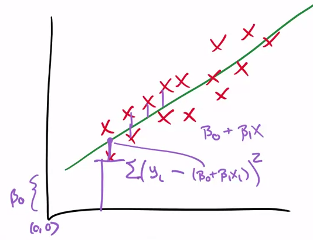

# Data Example

```{r, message=FALSE}
library("UsingR")
library("reshape")
library("ggplot2")
library("dplyr")
```

## Childred heights

```{r}
data(galton)
long <- melt(galton)
g <- ggplot(long, aes(x=value, fill=variable))
g <- g + geom_histogram(colour="black", binwidth=1)
g <- g + facet_grid(. ~ variable)
g
```

### Basic Least Square

```{r, echo = TRUE, eval = FALSE}
library(manipulate)
data(galton)
myHist <- function(mu) {
  mse <- mean((galton$child - mu)^2)
  g <- ggplot(galton, aes(x=child))
  g <- g + geom_histogram(colour="black", fill="salmon", binwidth=1)
  g <- g + geom_vline(xintercept=mu, size=3)
  g <- g + ggtitle(paste("mu = ", mu, " MSE (Mean Square Error)= ", round(mse, 2), sep=""))
  g
}
manipulate(myHist(mu), mu = slider(62, 74, step=0.5))
```

```{r}
g <- ggplot(galton, aes(x=child))
g <- g + geom_histogram(colour="black", fill="salmon", binwidth=1)
g <- g + geom_vline(xintercept=mean(galton$child), size=3)
g
mean(galton$child)
```

## Comparing childrens' height and their parent heights

A very bad plot
```{r}
ggplot(galton, aes(x = parent, y = child)) + geom_point()
```
There's overplotting, multiple points at the same location.

A better plot
```{r}
freqData <- as.data.frame(table(galton$child, galton$parent))
names(freqData) <- c("child", "parent", "freq")
freqData$child <- as.numeric(as.character(freqData$child))
freqData$parent <- as.numeric(as.character(freqData$parent))
g <- ggplot(filter(freqData, freq > 0), aes(x = parent, y = child))
g <- g  + scale_size(range = c(2, 20), guide = "none" )
g <- g + geom_point(colour="grey50", aes(size = freq+20, show_guide = FALSE))
g <- g + geom_point(aes(colour=freq, size = freq))
g <- g + scale_colour_gradient(low = "lightblue", high="white")                    
g
```

Regression to the origin

The regression line goes through $0,0$. But often $0,0$ is outside the data, so we center the data at $0,0$ the mean of $x$ and $y$.




```{r, echo = TRUE, eval = FALSE}
y <- galton$child - mean(galton$child)
x <- galton$parent - mean(galton$parent)
freqData <- as.data.frame(table(x, y))
names(freqData) <- c("child", "parent", "freq")
freqData$child <- as.numeric(as.character(freqData$child))
freqData$parent <- as.numeric(as.character(freqData$parent))
myPlot <- function(beta){
    g <- ggplot(filter(freqData, freq > 0), aes(x = parent, y = child))
    g <- g  + scale_size(range = c(2, 20), guide = "none" )
    g <- g + geom_point(colour="grey50", aes(size = freq+20, show_guide = FALSE))
    g <- g + geom_point(aes(colour=freq, size = freq))
    g <- g + scale_colour_gradient(low = "lightblue", high="white")                     
    g <- g + geom_abline(intercept = 0, slope = beta, size = 3)
    mse <- mean( (y - beta * x) ^2 )
    g <- g + ggtitle(paste("beta = ", beta, "mse = ", round(mse, 3)))
    g
}
manipulate(myPlot(beta), beta = slider(0.6, 1.2, step = 0.02))
```
A $\beta$ around $0.64$ seems to have the lowest mean square error.

### R Solution
```{r}
lm(I(child - mean(child))~ I(parent - mean(parent)) - 1, data = galton)
```

```{r, fig.height=6,fig.width=7,echo=FALSE}
freqData <- as.data.frame(table(galton$child, galton$parent))
names(freqData) <- c("child", "parent", "freq")
freqData$child <- as.numeric(as.character(freqData$child))
freqData$parent <- as.numeric(as.character(freqData$parent))
g <- ggplot(filter(freqData, freq > 0), aes(x = parent, y = child))
g <- g  + scale_size(range = c(2, 20), guide = "none" )
g <- g + geom_point(colour="grey50", aes(size = freq+20, show_guide = FALSE))
g <- g + geom_point(aes(colour=freq, size = freq))
g <- g + scale_colour_gradient(low = "lightblue", high="white")                    
lm1 <- lm(galton$child ~ galton$parent)
g <- g + geom_abline(intercept = coef(lm1)[1], slope = coef(lm1)[2], size = 3, colour = grey(.5))
g
```

With lm
```{r, fig.height=6,fig.width=7,echo=FALSE}
freqData <- as.data.frame(table(galton$child, galton$parent))
names(freqData) <- c("child", "parent", "freq")
freqData$child <- as.numeric(as.character(freqData$child))
freqData$parent <- as.numeric(as.character(freqData$parent))
g <- ggplot(filter(freqData, freq > 0), aes(x = parent, y = child))
g <- g  + scale_size(range = c(2, 20), guide = "none" )
g <- g + geom_point(colour="grey50", aes(size = freq+20, show_guide = FALSE))
g <- g + geom_point(aes(colour=freq, size = freq))
g <- g + scale_colour_gradient(low = "lightblue", high="white")                    
g <- g + geom_smooth(method="lm", formula=y~x)
g
```

# Notation

## Notation for data

* We write $X_1, X_2, \ldots, X_n$ to describe $n$ data points.
* As an example, consider the data set $\{1, 2, 5\}$ then 
  * $X_1 = 1$, $X_2 = 2$, $X_3 = 5$ and $n = 3$.
* We often use a different letter than $X$, such as $Y_1, \ldots , Y_n$.
* We will typically use Greek letters for things we don't know. 
  Such as, $\mu$ is a mean that we'd like to estimate.


## The empirical mean 

* Define the empirical mean as
$$
\bar X = \frac{1}{n}\sum_{i=1}^n X_i. 
$$
* Notice if we subtract the mean from data points, we get data that has mean 0. That is, if we define
$$
\tilde X_i = X_i - \bar X.
$$
The mean of the $\tilde X_i$ is 0.
* This process is called "centering" the random variables.
* Recall from the previous lecture that the mean is 
  the least squares solution for minimizing
  $$
  \sum_{i=1}^n (X_i - \mu)^2
  $$


## The emprical standard deviation and variance

* Define the empirical variance as 
$$
S^2 = \frac{1}{n-1} \sum_{i=1}^n (X_i - \bar X)^2 
= \frac{1}{n-1} \left( \sum_{i=1}^n X_i^2 - n \bar X ^ 2 \right)
$$
* The empirical standard deviation is defined as
$S = \sqrt{S^2}$. Notice that the standard deviation has the same units as the data.
* The data defined by $X_i / s$ have empirical standard deviation 1. This is called "scaling" the data.

## Normalization

* The data defined by
$$
Z_i = \frac{X_i - \bar X}{s}
$$
have empirical mean zero and empirical standard deviation 1. 
* The process of centering then scaling the data is called "normalizing" the data. 
* Normalized data are centered at 0 and have units equal to standard deviations of the original data. 
* Example, a value of 2 from normalized data means that data point
was two standard deviations larger than the mean.

## The empirical covariance
* Consider now when we have pairs of data, $(X_i, Y_i)$.
* Their empirical covariance is 
$$
Cov(X, Y) = 
\frac{1}{n-1}\sum_{i=1}^n (X_i - \bar X) (Y_i - \bar Y)
= \frac{1}{n-1}\left( \sum_{i=1}^n X_i Y_i - n \bar X \bar Y\right)
$$
* The correlation is defined is
$$
Cor(X, Y) = \frac{Cov(X, Y)}{S_x S_y}
$$
where $S_x$ and $S_y$ are the estimates of standard deviations 
for the $X$ observations and $Y$ observations, respectively.

## Some facts about correlation
* $Cor(X, Y) = Cor(Y, X)$
* $-1 \leq Cor(X, Y) \leq 1$
* $Cor(X,Y) = 1$ and $Cor(X, Y) = -1$ only when the $X$ or $Y$ observations fall perfectly on a positive or negative sloped line, respectively.
* $Cor(X, Y)$ measures the strength of the linear relationship between the $X$ and $Y$ data, with stronger relationships as $Cor(X,Y)$ heads towards -1 or 1.
* $Cor(X, Y) = 0$ implies no linear relationship. 
