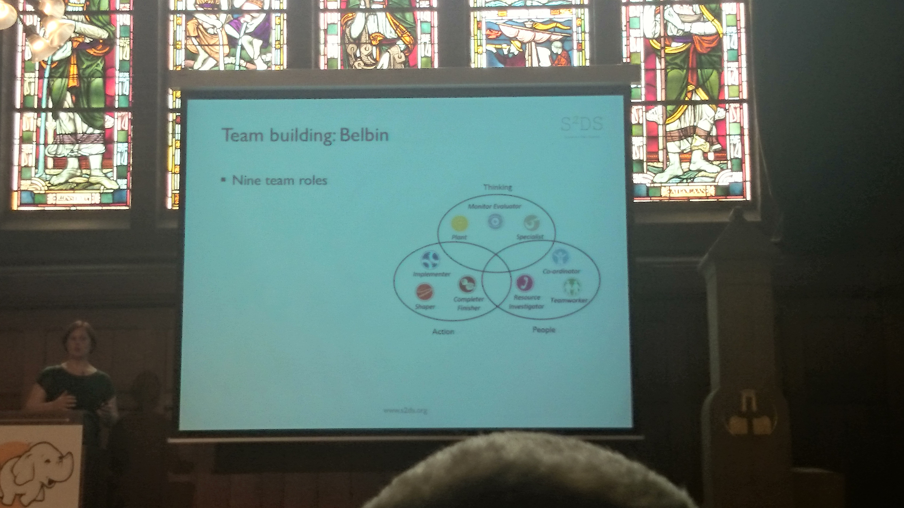

# Hadoop Summit 2014 Amsterdam
## Key Notes (Gartner, Hortonworks, Teradata)
- Data lake / Stausee
    + Hadoop ist der Stausee, die Stromgeneratoren die Tools
- ETL/ELT
- Lamda Architektur
- Hadoop = Data OS
- YARN
- TEZ
- Apache Falcon
    + Data processing workflows
    + über mehrere Datacenters
- Teradata
    + sql-h
    + smart loader
    + viewpoint

 
 
 

## Putting wings on the elephant (Facebook)
- Facebook chat und messaging auf HBase
- Tip: Java perf file auf tempfs mounten
- 100 Nodes per Cluster (19 Cluster)
- User einem Cluster zugeordnet
- Cluster sind unabhängig voneinander
- Cluster komplett in einem Datacenter

## Storm (Yahoo, Thaiwan)
- Framework: Pinball
    + [https://www.facebook.com/pinterestengineering](https://www.facebook.com/pinterestengineering)
    + [http://engineering.pinterest.com/post/74429563460/pinball-building-workflow-management](http://engineering.pinterest.com/post/74429563460/pinball-building-workflow-management)

## Data Analytics Team
- Scrum
- Belbin
    + [http://en.wikipedia.org/wiki/Team_Role_Inventories](http://en.wikipedia.org/wiki/Team_Role_Inventories)
    + [http://www.mindtools.com/pages/article/newLDR_83.htm](http://www.mindtools.com/pages/article/newLDR_83.htm)

 
 
 
 
 

## Hadoop Operations (Spotify)
- [http://www.jmxtrans.org/](http://www.jmxtrans.org/)
- White elephant
    + [http://data.linkedin.com/opensource/white-elephant](http://data.linkedin.com/opensource/white-elephant)

## Algorithms (Ted Dunning, Mapr)
- Co-Occurrence
- Thompson sampling
- Result dithering

 
 
 

## Key Notes (Visualisierung)
- https://openpaths.cc/
- Cascade visualization
    + [http://nytlabs.com/protect/projects/cascade.html](http://nytlabs.com/protect/projects/cascade.html)

## Big Data History (Teradata)
- BSP Bulk Synchronous Parallel
    + [http://en.wikipedia.org/wiki/Bulk_synchronous_parallel](http://en.wikipedia.org/wiki/Bulk_synchronous_parallel)
- 80% der Experimente auf Big Data schlagen fehl. Darum muss der Round Trip billig sein

 

## Dis-/Economies of scale
- RapidMiner: [http://radoop.eu](http://radoop.eu)

## Diverses

 
 
 