# R - Graphics

## plot()

- Plot takes two vectors as input parameters
- One vector contains the values for the x axis
- One vector contains the values for the y axis


### Simple plot

Remember: numbers are vectors, too!

```R
plot(1,2)
```

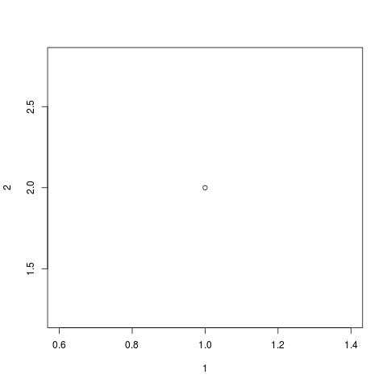


```R
plot(c(1,2,3), c(2,4,9))
```

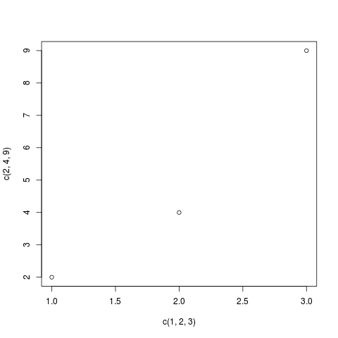


### Labels

```R
plot(c(1,2,3), c(2,4,9), xlab = 'x', ylab = 'y')
```

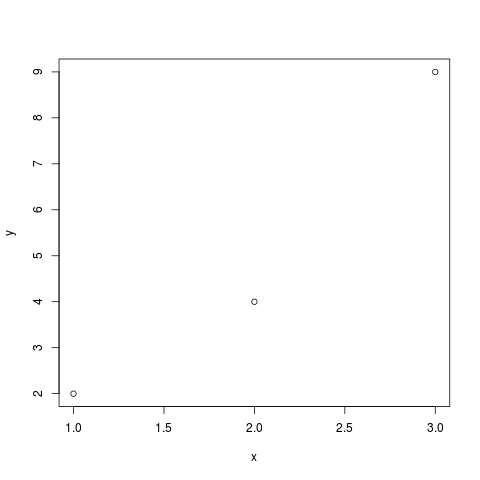


## Point rendering

You can define a character instead of a circle.


```R
plot(c(1,2,3), c(2,4,9), xlab = 'x', ylab = 'y', pch = "x")
```


### Type

Use the `type` attribute to select the type of the plot.

This will connect the points with a line

```R
plot(c(1,2,3), c(2,4,9), xlab = 'x', ylab = 'y', type="l")
```	

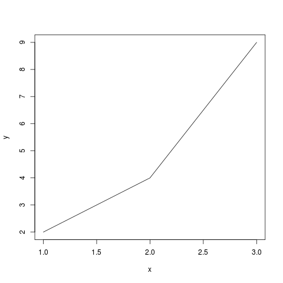


## Lines


### line type

Use the `lty` argument. See `help(par)` for valid values.

Plot a dotted line
```R
plot(c(1,2,3), c(2,4,9), xlab = 'x', ylab = 'y', type="l", lty = 2)
```

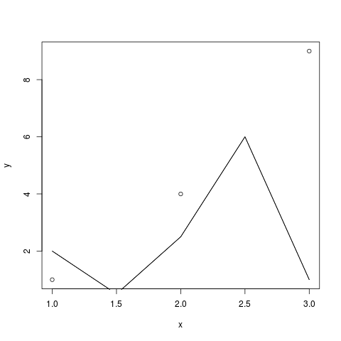


### abline() - Add straight line

```R
x <- c(1,2,3)
y <- c(1,4,9)
plot(x,y)
lmout <- lm(y ~ x)
abline(lmout)
```

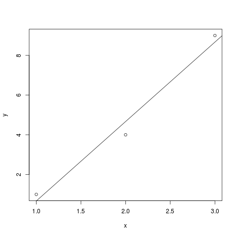


### lines()

```R
plot(x,y)
lines(c(1,1.5,2,2.5,3), c(2,0.5,2.5,6,1))
```


### smoothing points

Check out `lowess()` and `loess()`.


## Text


```R
hist(rnorm(100))
text(-2.5, 10, "Foo")
```

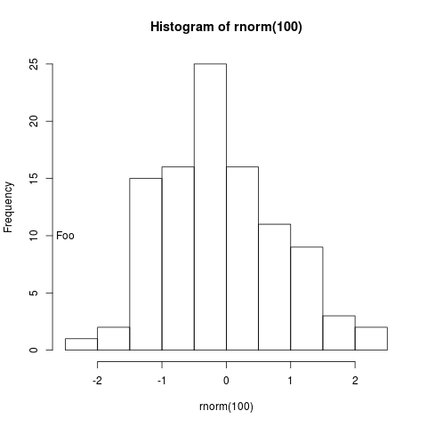


Find an exact location. Execute and click on the plot to print out the location clicked.

```R
hist(rnorm(100))
loc <- locator(2) # number of locations to select
loc
```

Try this!

```R
hist(rnorm(100))
loc <- locator(2) # number of locations to select
text(locator(1), "Foo")
```


### Font size

Use the `cex` attribute. It stands for character expand.

```R
hist(rnorm(100))
text(0, 10, "Foo", cex=2)
text(-1.5, 10, "Foo")
```

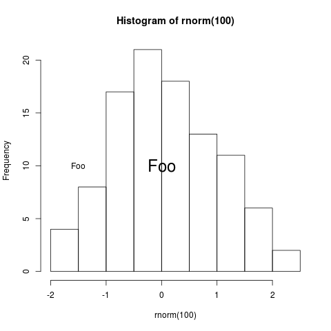


## Curves

```R
f <- function(x) return(1-exp(-x))
curve(f, 0, 10)
```

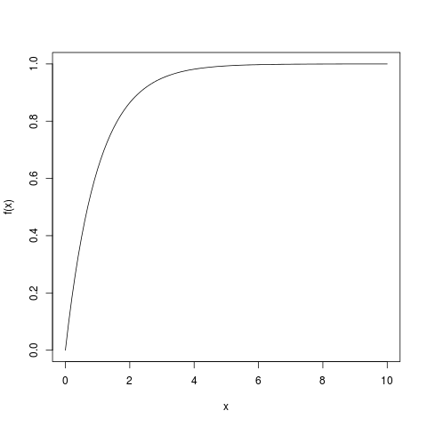

To add a curve to an existing plot add the `add=TRUE` attribute.


## Plygons

```R
curve(1-exp(-x), 0,2)
polygon(c(1.2,1.5,1.5,1.2), c(0,0,f(1.2), f(1.2)), col="red", density=20)
```

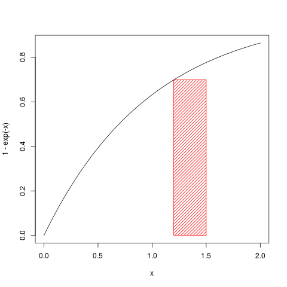


## Axis Ranges

Use `xlim` and `ylim`. Notice that these attributes take a vector with from and to as elements!

```R
> plot(c(1:10), c(11:20), xlim=c(0,30), ylim=c(0,30))
```

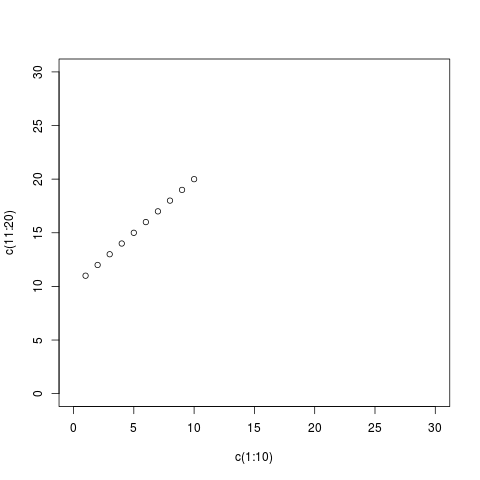


## Parameters

Some parameters have to be set before the rendering function gets called.


### Background Color

```R
par(bg="yellow")
hist(rnorm(100))
```


## Multiple Graphics

This is OS specific

- Linux: `x11()`
- Mac: `quartz()`
- Windows: `windows()`

This will open a new graphic window.


## Save graphics

```R
> png("test.png")
> hist(rnorm(100))
> dev.off()
```

Other formats are supported. Use appropriate function like `pdf()`, `jpeg()`.

The output size of the image can be set by attributes `with` and `height`.


## 3D Graphics

- persp()
- wireframe()
- cloud()

