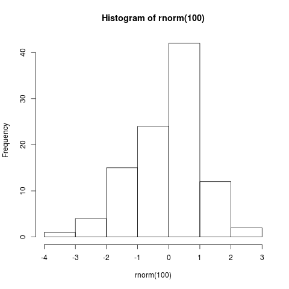

# R - Statistical functions


## rnorm() - Normal distribution

- [Wikipedia (en)](https://en.wikipedia.org/wiki/Normal_distribution)
- [Wikipedia (de)](https://de.wikipedia.org/wiki/Normalverteilung)


## mean() - Arithmetic mean

- [Wikipedia (en)](https://en.wikipedia.org/wiki/Arithmetic_mean)
- [Wikipedia (de)](https://de.wikipedia.org/wiki/Arithmetisches_Mittel)

The arithmetic mean (or simply "mean") of a sample ``x1, x2, ..., xn``
is the sum of the sampled values divided by the number of items in the sample


## hist() - Histogram

- [Wikipedia (en)](https://en.wikipedia.org/wiki/Histogram)
- [Wikipedia (de)](https://de.wikipedia.org/wiki/Histogramm)

In statistics, a histogram is a graphical representation of the distribution of data.

```R
hist(rnorm(100))
```



### Number of columns

The number of columns (classes) is choosen automatically based on your input. It uses the Sturges formula. You can override it by defining the number of ``breaks``.

```R
hist(z, breaks=12)
```


## lm() - Liniear model


## sd() - Standard deviation

- [Wikipedia (en)](https://en.wikipedia.org/wiki/Standard_deviation)
- [Wikipedia (de)](https://de.wikipedia.org/wiki/Standardabweichung)
